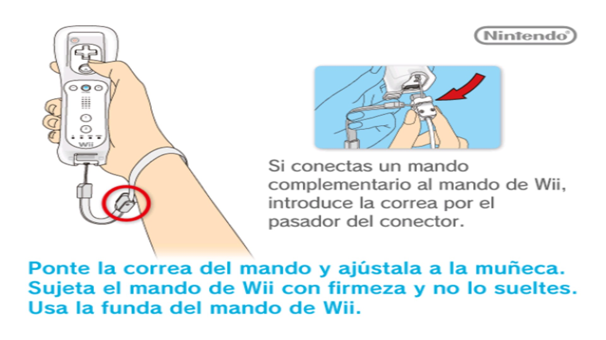

<a id="readme-top"></a>

<div align="center">


# Project LUMA

### Super Mario Galaxy — Native PC Port

**A native, cross-platform reimplementation of Super Mario Galaxy 1 for modern PCs.**

[](https://github.com/GaudiestBaker74/Project-LUMA)
[](https://github.com/GaudiestBaker74/Project-LUMA)
[](https://isocpp.org/)
[](https://www.vulkan.org/)
[](https://cmake.org/)
[](https://github.com/GaudiestBaker74/Project-LUMA)
[](https://github.com/GaudiestBaker74/Project-LUMA)

<br>

[**Documentation**](docs/) ·
[**Roadmap**](docs/milestones.md) ·
[**Build Guide**](docs/build.md) ·
[**Issues**](https://github.com/GaudiestBaker74/Project-LUMA/issues)

</div>

---

## ✨ What is LUMA?

**Project LUMA** is an independent open-source effort to bring **Super Mario Galaxy 1** to modern Windows and Linux systems as a **native application**.

LUMA is **not a Wii emulator**.

Instead of emulating the Wii hardware and running the original executable inside an emulated environment, LUMA recompiles the game's decompiled C/C++ code for modern platforms and replaces the original Wii-specific runtime APIs with native implementations.

The project is built around the excellent **[SMGCommunity/Petari](https://github.com/SMGCommunity/Petari)** decompilation.

The long-term goal is simple:

> **Run Super Mario Galaxy natively on a modern PC while preserving the original game's behaviour as faithfully as possible.**

---

## 🕹️ Boot Progress

 </div>

Project LUMA is currently working through the game's initialization and boot pipeline.

The current milestone is M9 — First Real Boot, with the project progressively reaching more of the original game's startup sequence.

Note: These screenshots show the current technical boot progress. Gameplay and Title Screen has not yet been reached (for now).


## 🎮 Screenshots

> Screenshots below are development captures and may change significantly as the renderer and game boot process evolve.

<div align="center">

GAME BOOT


</div>

### More screenshots 

|          Renderer          |          Runtime          |          Debug          |
| :------------------------: | :-----------------------: | :---------------------: |
|         Coming Soon        |        Coming Soon        |       Coming Soon       |
|                            |                           |                         |

---

# 🧭 How does it work?

The most important distinction between LUMA and an emulator is **where the original game code runs**.

A traditional Wii emulator looks roughly like this:

```text
┌──────────────────────────────┐
│      Super Mario Galaxy      │
│       Original Wii code      │
└──────────────┬───────────────┘
               │
               ▼
┌──────────────────────────────┐
│        Wii Emulator          │
│ CPU • GPU • OS • DVD • DSP   │
│ Memory • Controllers • etc.  │
└──────────────┬───────────────┘
               │
               ▼
          Windows / Linux
```

LUMA takes a different approach:

```text
┌──────────────────────────────┐
│      Super Mario Galaxy      │
│        Decompiled code       │
└──────────────┬───────────────┘
               │
               ▼
┌──────────────────────────────┐
│     Wii Compatibility Layer  │
│ OS • GX • DVD • VI • WPAD    │
│ KPAD • AX • NAND • JSystem   │
└──────────────┬───────────────┘
               │
               ▼
┌──────────────────────────────┐
│      Platform Abstraction    │
│ Filesystem • Input • Audio   │
│ Threads • Timing • Window    │
└──────────────┬───────────────┘
               │
        ┌──────┴──────┐
        ▼             ▼
     Windows         Linux
        │             │
        └──────┬──────┘
               ▼
          Vulkan / SDL3
```

### In other words

The original game expects APIs such as:

* `GX`
* `VI`
* `DVD`
* `OS`
* `WPAD`
* `KPAD`
* `PAD`
* `AX`
* `NAND`
* `JSystem`
* `nw4r`

LUMA provides PC implementations of those systems.

The game logic remains on top:

```text
                  GAME CODE
                      │
                      ▼
             Wii-compatible APIs
                      │
          ┌───────────┴───────────┐
          ▼                       ▼
      Platform                  Renderer
      systems                  abstraction
          │                       │
          ▼                       ▼
     Windows/Linux              Vulkan
```

This separation makes it possible to replace platform-specific implementations without unnecessarily modifying the decompiled game logic.

---

# 🏗️ Architecture

LUMA is split into several layers.

```text
Project-LUMA/
│
├── src/
│   ├── main.cpp
│   │
│   ├── platform/
│   │   ├── windows/
│   │   ├── linux/
│   │   ├── renderer/
│   │   ├── input/
│   │   ├── audio/
│   │   ├── filesystem/
│   │   └── ...
│   │
│   ├── compat/
│   │   ├── os/
│   │   ├── dvd/
│   │   ├── vi/
│   │   ├── gx/
│   │   ├── wpad/
│   │   ├── kpad/
│   │   ├── pad/
│   │   ├── ax/
│   │   ├── jsystem/
│   │   ├── nw4r/
│   │   └── ...
│   │
│   ├── tools/
│   └── tests/
│
├── third_party/
│   └── petari/
│
├── tools/
├── docs/
│   └── images/
│
├── assets/
│
└── CMakeLists.txt
```

### `src/compat/`

The **Wii compatibility layer**.

This is where LUMA recreates the APIs expected by the decompiled game.

Examples:

```text
OS       → operating-system functionality
DVD      → Wii disc/file access
GX       → graphics API
VI       → video interface
WPAD     → Wii Remote
KPAD     → controller abstraction
AX       → audio interface
NAND     → Wii filesystem services
```

---

### `src/platform/`

The **native PC platform layer**.

It provides platform-independent interfaces for:

* Window management
* Input
* Audio
* Filesystem
* Timing
* Threads
* Memory
* Logging
* Video
* Rendering

Platform-specific code lives underneath:

```text
platform/
├── windows/
└── linux/
```

The goal is that higher-level code doesn't need to care whether it is running on Windows or Linux.

---

### `src/platform/renderer/`

The renderer abstraction.

The initial graphics backend is:

```text
Nintendo GX
      │
      ▼
GX Compatibility Layer
      │
      ▼
Renderer Abstraction
      │
      ▼
Vulkan 1.3
      │
      ▼
GPU
```

The renderer is intentionally separated from the GX compatibility layer so that a future backend can be added without rewriting the game's graphics-facing code.

A possible future backend is **D3D12**, but Vulkan is the initial target.

---

# 🎨 Rendering

Super Mario Galaxy was originally designed around Nintendo's **GX** graphics API.

LUMA cannot simply call GX on a PC.

Instead, GX commands are interpreted by the compatibility layer and translated into the renderer abstraction.

```text
Galaxy game code
       │
       ▼
   GX calls
       │
       ▼
┌─────────────────┐
│  GX Compat      │
│                 │
│ state           │
│ textures        │
│ shaders         │
│ vertex data     │
│ framebuffers    │
└────────┬────────┘
         │
         ▼
Renderer API
         │
         ▼
      Vulkan
```

This is one of the largest technical components of the project.

See:

* [`docs/gx.md`](docs/gx.md)
* [`docs/renderer.md`](docs/renderer.md)

---

# 🎮 Input

Input is provided through **SDL3** and translated into the interfaces expected by the original game.

Supported PC input includes:

| Input                    | Support |
| ------------------------ | :-----: |
| Keyboard                 |    ✅    |
| Mouse                    |    ✅    |
| Gamepads                 |    ✅    |
| Xbox controllers         |    ✅    |
| DualShock / DualSense    |    ✅    |
| Hot-plugging             |    ✅    |
| Rumble                   |    ✅    |
| Configurable controls    |    🚧   |
| Wii Remote-style mapping |    🚧   |

### Default keyboard layout

| Key          | Wii-style action |
| ------------ | ---------------- |
| `W A S D`    | Nunchuk Stick    |
| `SPACE`      | A                |
| `LEFT CLICK` | B                |
| `MOUSE`      | Pointer          |
| `ARROW KEYS` | D-Pad            |
| `+ / -`      | Plus / Minus     |
| `HOME / ESC` | Exit             |

More information: [`docs/input.md`](docs/input.md)

---

# 📦 Assets

LUMA **does not distribute Nintendo's proprietary game data**.

The repository does not contain:

* ROMs
* ISOs
* WADs
* Nintendo models
* Textures
* Music
* Sound effects
* Other copyrighted game data

Instead, LUMA expects the user to provide the required data from their **own legitimate copy** of Super Mario Galaxy.

The local layout is:

```text
Project-LUMA/
└── assets/
    ├── ...
    └── ...
```

`assets/` is intentionally ignored by Git.

Nothing is downloaded automatically.

The asset pipeline includes support for systems such as:

```text
Virtual filesystem
      │
      ▼
Wii-style DVD API
      │
      ▼
FST / directory access
      │
      ▼
RARC archives
      │
      ▼
Yaz0 decompression
      │
      ▼
JKRArchive
      │
      ▼
Game resources
```

See [`docs/assets.md`](docs/assets.md).

---

# 🔊 Audio

The original game uses Nintendo's audio stack.

LUMA is building a native compatibility layer around the original **JAudio2** architecture.

Current areas include:

* CPU-side DSP / JDSP compatibility
* `compat/ai`
* SDL3 audio output
* Headless audio support
* Native JAudio2 compilation

See [`docs/audio.md`](docs/audio.md).

---

# 🧪 Testing

LUMA is designed around incremental development.

The project uses:

* **doctest**
* **CTest**
* Renderer tests
* Vulkan headless tests
* Compatibility-layer tests
* Input tests
* Asset tests
* Archive tests
* Layout tests

The intended development cycle is:

```text
        ┌──────────┐
        │   CODE   │
        └────┬─────┘
             │
             ▼
        ┌──────────┐
        │   BUILD  │
        └────┬─────┘
             │
             ▼
        ┌──────────┐
        │   TEST   │
        └────┬─────┘
             │
             ▼
       ┌────────────┐
       │    CTEST   │
       └─────┬──────┘
             │
       ┌─────┴─────┐
       ▼           ▼
     PASS         FAIL
       │           │
       └─────┬─────┘
             ▼
          iterate
```

---

# 📊 Development Status

LUMA is under active development.

| Milestone | Description                 | Status |
| :-------: | --------------------------- | :----: |
|   **M0**  | Analysis & Architecture     |    ✅   |
|   **M1**  | PC Build + Platform Core    |    ✅   |
|   **M2**  | Windows Support             |    ✅   |
|   **M3**  | Window + Vulkan + Game Loop |    ✅   |
|   **M4**  | Renderer API                |    ✅   |
|   **M5**  | GX Compatibility            |    ✅   |
|   **M6**  | Complete Input System       |    ✅   |
|  **M6.5** | JMath / JGeometry           |    ✅   |
|   **M7**  | VFS + Assets                |    ✅   |
|   **M8**  | Audio Core                  |    ✅   |
|   **M9**  | First Real Boot             |   🚧   |
|  **M10**  | First Playable Galaxy       |    ⏳   |
|  **M11**  | Full Game                   |    ⏳   |

> **Important:** milestone percentages describe the state of the technical porting infrastructure. They do **not** mean that the same percentage of the original game is playable.

For the detailed roadmap, see [`docs/milestones.md`](docs/milestones.md).

---

# 🛠️ Building

## Requirements

You will need:

* Git
* CMake
* A C++20-compatible compiler
* Vulkan 1.3-capable hardware/driver
* SDL3
* A legitimate copy of Super Mario Galaxy for the required assets

For complete instructions:

**→ [`docs/build.md`](docs/build.md)**

---

## Linux

```bash
git clone https://github.com/GaudiestBaker74/Project-LUMA.git
cd Project-LUMA

git submodule update --init --recursive

cmake -B build -DPLATFORM=PC
cmake --build build

ctest --test-dir build
```

---

## Windows

Using Visual Studio / MSVC:

```powershell
git clone https://github.com/GaudiestBaker74/Project-LUMA.git
cd Project-LUMA

git submodule update --init --recursive

cmake -B build -DPLATFORM=PC
cmake --build build --config Release

ctest --test-dir build -C Release
```

> Asset extraction and placement is intentionally kept separate from the source build. See [`docs/assets.md`](docs/assets.md).

---

# 🗺️ Documentation

| Document                                  | Description                               |
| ----------------------------------------- | ----------------------------------------- |
| [`architecture.md`](docs/architecture.md) | Overall architecture and design decisions |
| [`build.md`](docs/build.md)               | Building LUMA                             |
| [`porting.md`](docs/porting.md)           | Porting methodology and conventions       |
| [`renderer.md`](docs/renderer.md)         | Renderer architecture                     |
| [`gx.md`](docs/gx.md)                     | GX compatibility layer                    |
| [`input.md`](docs/input.md)               | Input architecture                        |
| [`audio.md`](docs/audio.md)               | Audio architecture                        |
| [`assets.md`](docs/assets.md)             | Asset and resource pipeline               |
| [`boot.md`](docs/boot.md)                 | Boot process                              |
| [`milestones.md`](docs/milestones.md)     | Development roadmap                       |

---

# 🤝 Contributing

Contributions, testing, documentation improvements and technical discussion are welcome.

Before contributing, please read:

1. [`docs/architecture.md`](docs/architecture.md)
2. [`docs/porting.md`](docs/porting.md)
3. [`docs/milestones.md`](docs/milestones.md)

### Development principles

**Keep the game logic clean.**

Whenever possible, avoid modifying upstream Petari code unnecessarily.

**Prefer compatibility implementations.**

If the original game expects a Wii API, implement that API in `src/compat/` rather than scattering PC-specific workarounds throughout the game.

**Keep platform code isolated.**

Windows/Linux differences should remain inside the platform abstraction.

**Test new behaviour.**

New compatibility functionality should come with tests whenever practical.

---

# ⚖️ Legal

Project LUMA is an independent fan-made technical project.

It is **not affiliated with, endorsed by, or sponsored by Nintendo**.

Nintendo and Super Mario Galaxy are trademarks and/or properties of their respective owners.

This repository does **not** distribute copyrighted Nintendo game assets and does not provide those assets.

The project expects users to supply data obtained from their own legitimate copy of the game.

---

# 📜 Licenses

The Project LUMA source tree is distributed under the **Unlicense**, unless otherwise noted.

The Petari source is included as a third-party dependency/submodule and retains its own licensing.

See:

* [`LICENSE`](LICENSE)
* [`third_party/petari/LICENSE`](third_party/petari/LICENSE)

---

# 🙏 Acknowledgements

Project LUMA would not exist without the work of the reverse-engineering and game-decompilation community.

Special thanks to:

* **[SMGCommunity / Petari](https://github.com/SMGCommunity/Petari)**
* The contributors to the Super Mario Galaxy decompilation effort
* The developers and maintainers of the open-source libraries used by LUMA
* Everyone contributing research, testing and documentation to the project
* For now you can only use RMGK01 (Korea's SMG ROM) but in the future will be able to play with every SMG ROM
* AI was used to make this possible

---

<div align="center">

## ⭐ If you're interested in the project

Watch the repository, follow development, test builds when available, and contribute technical knowledge where you can.

<br>

**Project LUMA**

<br>

[⬆ Back to top](#readme-top)

</div>
