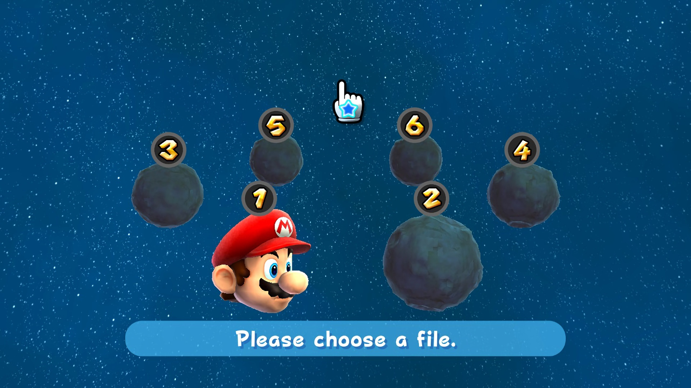
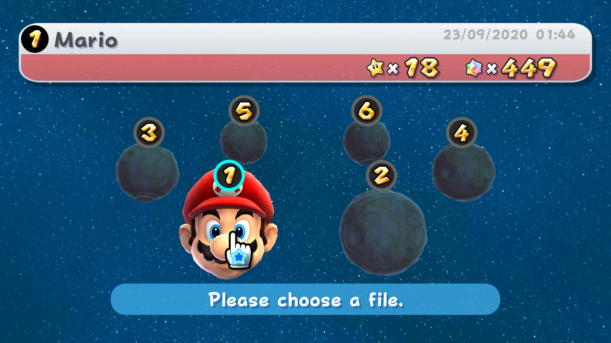
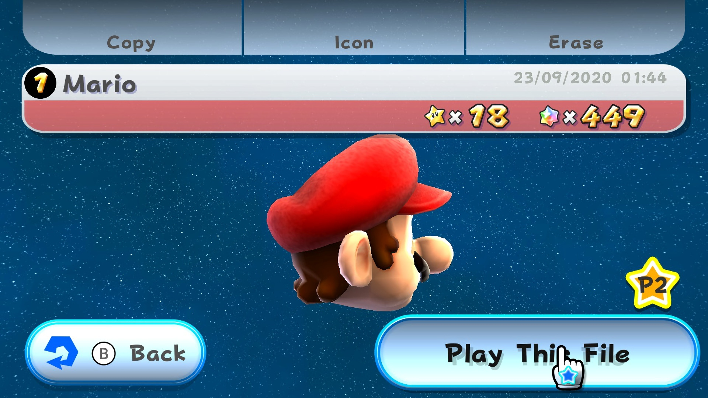

# La pantalla de selección de archivo (M10)

La pantalla que aparece al decidir el title con A+B: los seis planetas con los
números, la cabeza del personaje, la barra de datos del archivo y los botones de
operación. En consola la sirve `Game/Map/FileSelector.cpp` — un `LiveActor` de
~1585 líneas con 40 nerves que posee los `FileSelectItem`, el
`FileSelectCameraController`, la `FileSelectInfo`, los `FileSelectButton`, el
`BackButton`/`BrosButton`, el selector de Mii (RFL) y el archivo de usuario.

Como ese actor no se puede instanciar aún en el port (le faltan ModelManager,
J3D draw buffers, el sistema de mensajes y RFL), la pantalla la reproduce
`src/compat/game/FileSelectHost.cpp` sobre los **assets reales** y las
**constantes reales** del decomp.

## 1. Las tres capturas de referencia

`docs/images/fileselect/1_seleccion_save.png`, `2_seleccion_save.png` y
`3_seleccion_save.png` (1920x1080, GameUIDatabase) son el objetivo: la
animación completa de la pantalla. `antes-m10-1.png` es el estado que reportó
el bug (panes en japonés, botón en otro idioma, sin planetas, sin música y el
cursor de disco naranja).

| Captura | Estado | Qué se ve |
|---|---|---|
| 1 | nada apuntado | 6 planetas en V con sus números, la cabeza de Mario entre 1 y 2, la barra azul "Please choose a file.", **ningún botón** |
| 2 | planeta 1 apuntado | igual + la barra de archivo arriba (Mario, 23/09/2020 01:44, ★x18, ✦x449) + el icono del mando de P1 sobre el planeta |
| 3 | archivo seleccionado | los planetas se van al fondo, la cabeza en primer plano, las pestañas Copy/Icon/Erase arriba, "Play This File" abajo a la derecha, "⟨B⟩ Back" abajo a la izquierda y la estrella P2 |

## 2. Qué monta la pantalla

| Pieza | Asset / módulo | Notas |
|---|---|---|
| Botones de operación | `FileSelect.arc` → layout `FileSelect` | vía `SimpleLayout` (mismo camino que `TitleLogo`/`PressStart`); los botones arrancan OCULTOS (`StartButton`, `CopyButton`, `MiiButton`, `DeleteButton`, `2P`) |
| Barra de datos | `FileInfo.arc` → layout `FileInfo` (3 capas) | `Appear` (capa 0) + `ButtonAppear`/`ButtonEnd` (capa 1) = el contrato de deslizamiento de `FileSelectInfo::SlideState` |
| Botón Back | `BackButton.arc` → layout `BackButton` (1 capa) | aparece sólo al seleccionar archivo |
| Estrella P2 | `BrosButton.arc` → layout `BrosButton` | ídem |
| Números 1–6 | `FileNumber.arc` → layout `FileNumber` (2 capas), **6 instancias** | `MR::setTextBoxNumberRecursive` equivalente: el número va al `TextBox` del layout |
| Planetas y cabezas | `ObjectData/FileSelectDataPlanet.arc` + `FileSelectData{Mario,Luigi,Yoshi,Kinopio,Peach}.arc` | `compat/j3d/FileSelectField` (parser BMD + renderer J3D del port), escala 30 |
| Cielo | `CometNearOrbitSky` | el `FileSelectSky` real; ya lo dibujaba el title (`compat/j3d/TitleSky`) |
| Barra "Please choose a file." | **no es un pane** | es la guía 1P del StarPointer: `StarPointerUtil.cpp:912` `request1PGuidance("System_FileSelect008")` → `compat/ui/GuidanceBanner` |
| Cursor (puntero) | `DPDPointer.arc` → pane `StarPointer` | el propio StarPointer de consola: `StarPointerLayout::changeToStarPointer` muestra el árbol `StarPointer` (guante blanco con estrella azul, el puntero de P1) y oculta `HandPointer`; `setPosition` lo traslada al puntero cada frame. Es el último layout creado, así que el pase de layouts lo dibuja encima de todo. Si el arc no monta, queda un guante immediate-mode de respaldo (`drawCursor`) |
| Anillo de objetivo | `DPDPointer.arc` → grupo `GroupRing` | el círculo cian que la consola pone sobre el ítem apuntado (`StarPointerUtil::addStarPointerTargetCircle`); `updatePointerLayout` lo posiciona en la proyección de la insignia del ítem |
| Texto | `compat/game/GameTextTable` | los ids reales (`Layout_<layout><pane>` sin sufijo de idioma) |

## 3. La geometría, medida de la captura

Los planetas de `FileSelector::calcBasePos` **no tienen cuerpo decompilado**
(petari deja solo un comentario), así que la tabla se reconstruyó de la captura
y se resolvió numéricamente:

1. se localizan los seis números por su tinta dorada (flood-fill) en
   `docs/images/fileselect/1_seleccion_save.png`; salen tres pares simétricos en unidades de
   diseño (456 de alto): `1/2 (-101.1, -4.1)/(100.6, -5.3)`,
   `3/4 (-207.9, 51.2)/(207.1, 50.6)`, `5/6 (-82.0, 80.8)/(80.3, 79.4)`;
2. cada par se invierte por la cámara `far` del `FileSelectCameraController`
   (`pos (0,0,15000)` → `target (0,800,0)`, fovy 40; 228 unidades de diseño por
   `tan(20°)` en el plano de proyección) y da la posición **de la insignia** en
   el mundo;
3. la posición del ítem es la de la insignia menos `kBadgeHeight` (1020), que es
   la relación que implementa `calcBadgeWorldPos`.

La tabla final (`kPlacements` en `compat/j3d/FileSelectField.cpp`) reproduce las
posiciones medidas con **≤ 2.6 px** de error a 1080p. `LUMA_FILESELECT_LAYOUT`
escala el abanico sin tocar código.

La barra azul se midió igual: en la captura (1920x1080) mide **1165 x 97 px**,
borde inferior en **y = 990 px**, centrada; en unidades de diseño 491.9 x 41.0,
borde inferior y = −190, y el texto en inglés mide 256.3 unidades. El ancho de la
barra es `texto + 236` unidades (118 de padding por lado), así que una cadena
localizada más larga la ensancha simétricamente, como la ventana de consola.

## 4. Estados y máquina de fases

`FileSelectPhase` recorre lo mismo que los nerves del `FileSelector`:

| Fase | Nerve de consola | Contenido |
|---|---|---|
| `Appear` | `TitleEnd` | los ítems entran (45 frames = 0.75 s) mientras la cámara vuela del punto *title* (fovy 60) al *far* (fovy 40) en esos mismos 45 frames con tiempo al cuadrado — la vista *far* de la captura queda exactamente a punto cuando la pantalla pasa a `Select`; arranca `MBGM_FILE_SELECT` |
| `Select` | `FileSelect` | puntero sobre un ítem: escala a 1.2 (`ScaleController`), la cámara se va al punto *near* del ítem, la barra de archivo entra con sus datos y la guía sigue visible |
| `Confirm` | `FileConfirm`/`CreateConfirm` | al decidir: `calcBasePos(-16000)` empuja el abanico, la cámara sigue al ítem elegido y aparecen los botones; Copy/Icon/Erase tienen efecto (Copy al primer hueco libre, Erase borra el slot), B/Back vuelve |
| `Playing` | `DemoStartWait` | "Play This File": se crea/actualiza el slot, `SE_SY_FILE_SELECTED` + `stopStageBGM(90)` y el port avisa de que la GameScene aún no está (M10.2) |

## 5. Entrada

El puntero y los clics usan la semántica de menú del M10.1
(`Platform::CompatInput::getMenuDecideTrigger` = A **o** clic izquierdo;
`getMenuCancelTrigger` = B **o** clic derecho; `getMenuNav` = D-pad/stick). Es
el punto que hacía que "el clic no funcionara": el default de gameplay mapea
el ratón izquierdo a B, así que una pantalla que leyera `WPAD_BUTTON_A` nunca
veía el clic. Los botones de la fase `Confirm` se prueban contra el rectángulo
de su pane en píxeles (`paneContains`), incluyendo sus hijos-texto, de modo que
el clic vale sobre el icono o sobre la palabra.

El cursor es el **StarPointer del propio juego**: el port monta el layout
`DPDPointer` (el mismo arc que usa el `StarPointerLayout` de consola) y muestra
el pane `StarPointer` — el guante blanco con la estrella azul, que es el
puntero del jugador 1. Se posiciona cada frame con la misma regla de
`StarPointerLayout::setPosition` (el root pane se traduce a la posición del
puntero en espacio de layout) y se dibuja en el pase de layouts, encima de
todo. Sustituye al disco naranja del stand-in M10. Y al icono de mando
dibujado a mano del M10.1 (que no era un asset del juego). Si el arc no
monta (dump incompleto), un guante immediate-mode de respaldo mantiene la
pantalla usable. Sobre el ítem apuntado aparece además el **anillo de
objetivo** (el grupo `GroupRing` del mismo arc): el círculo cian de la
captura 2.

## 6. Texto en un solo idioma

El arc de `FileSelect.arc` trae, para el mismo rótulo, un pane por idioma
(`TxtStart`, `TxtStartJpJa`, `TxtStartUsEn`, `TxtStartEuEn`, …) y el
`LayoutManager` conserva sólo el del idioma activo
(`removeUnnecessaryPanes`). Aun así la pantalla mezclaba idiomas porque:

* los textos de los panes sin variante quedaban con el texto *de diseño* del
  brlyt (inglés), y
* el sistema de mensajes (`/MessageData/Message.arc`, BMG + `MessageId.tbl`) no
  está portado, así que nadie sustituía nada.

La solución del port es `compat/game/GameTextTable`: la tabla de mensajes de la
pantalla (los ids `Layout_FileSelect*`, `Layout_BackButton*`,
`System_FileSelect*`, `System_Date000`/`System_Time002`) en los 12 idiomas del
disco, que `LayoutManagerCompat::initTextBoxRecursive` consulta antes que
cualquier fallback. En cuanto entre el lector BMG real, sólo cambia la
consulta, no los sitios de llamada.

Ojo con un matiz que costó un bug: el pane `TxtStart` es el **botón** (su texto
es "Play This File" / "Jouer avec ces données" / "このデータで遊ぶ"), no la
barra de guía. La cadena de la barra es `System_FileSelect008`.

## 7. Qué falta (M10.2)

* `GameScene`: "Play This File" deja el slot escrito y para el BGM, pero la
  escena de juego no está portada — es el siguiente hito.
* Ventanas de confirmación (`SysInfoWindow`: borrar/copiar/Mii) y las guías
  contextuales del StarPointer (`System_FileSelect001`…`016`). Borrar hoy borra
  directamente y lo deja en el log.
* Iconos de Mii (`RVLFaceLib`) y el 2P (`Manual2P`): Copy y Erase funcionan,
  Icon es un no-op con aviso.
* `MR::isStarPointerPointingPane` / `LayoutManager::isPointing` siguen
  devolviendo `false`: mientras no exista el `StarPointerDirector`, los
  `ButtonPaneController` de consola no se pueden reutilizar y la pantalla prueba
  los rectángulos de pane con su propio hit test.
* El modelo `FileSelectDataPlanet` se dibuja con el J3D del port; sus materiales
  avanzados (projmap del `FileSelectSky`, `mProjmapEffectMtxSetter`) llegan con
  el resto del J3D.

## 8. Pruebas

`src/tests/fileselect_test.cpp`:

* `fileselect_save_round_trip_and_erase`, `fileselect_v1_marker_reads_as_an_empty_mario_file`
  — el store de partidas (formato v2 y compatibilidad con el marcador v1 de M10);
* `fileselect_guidance_balloon_matches_the_reference_capture` — la geometría de
  la barra azul (1165 x 97 px, borde inferior 990, centrada) y su
  ensanchamiento simétrico;
* `fileselect_strings_follow_the_selected_language`,
  `fileselect_pane_suffix_resolves_to_the_same_message` — un solo idioma en toda
  la pantalla y resolución del sufijo de idioma de los panes;
* `fileselect_2p_badge_reads_p2_in_every_language` — la estrella de jugador se
  lee "P2" en los 12 idiomas (es un número de jugador, no una palabra
  traducible; la captura de referencia lo muestra idéntico en inglés y
  japonés);
* `fileselect_field_placement_is_symmetric_under_the_planet_heads`,
  `fileselect_camera_states_are_the_controller_constants` — el abanico de
  planetas, la insignia por encima del planeta, las tres cámaras del
  `FileSelectCameraController` y que la proyección devuelve las posiciones
  medidas en la captura;
* `fileselect_screen_starts_in_the_appear_phase_without_buttons` — el arranque
  sin botones y el vuelo de cámara inicial.
